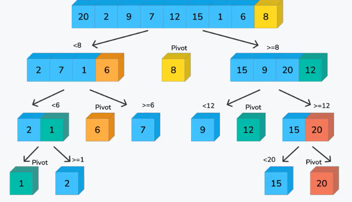

## 什么是不稳定的排序算法？
不稳定的排序算法指的是，对于具有相同值的元素，排序后它们的相对顺序可能会发生改变。换句话说，如果原列表中位置靠前的元素在排序后位置靠后，那么该排序算法就被认为是不稳定的。例如，对于原列表 [5a, 3, 5b, 2, 1]，其中 5a 和 5b 是相同的值，如果排序后的结果是 [1, 2, 3, 5b, 5a]，则该排序算法就是不稳定的，因为原本位置靠前的 5a 在排序后位置靠后。
## 排序算法的时间复杂度？
[点击跳转](https://www.runoob.com/w3cnote/ten-sorting-algorithm.html)

## 快速排序

